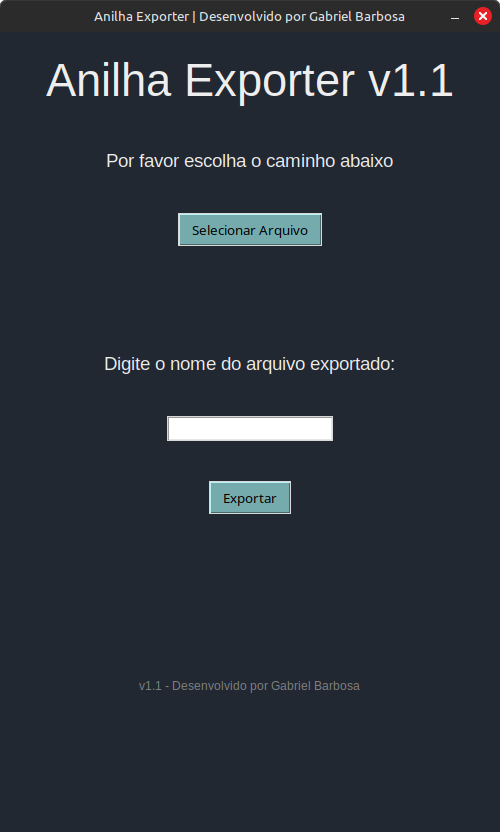
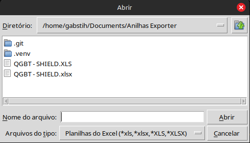

# Exportador de Anilhas

Aplicativo para exportar anilhas para utilizar no software Elesys.

## Descrição

O anilha exporter é um projeto desenvolvido com fins educativos para que eu possa aprender mais sobre python e Tkinter.
Criado principalmente para automatizar o processo de exportação de anilhas que eu utilizo no meu atual setor de Montagem Elétrica.
Com este programa, é possível importar um arquivo do excel (.xls ou .xlsx), copiar duas colunas de uma tabela de anilhas, e exportá-lo em um novo arquivo com o nome de sua preferência.

## Começando

### Como usar

Ao executar o programa Anilha Exporter, está será a tela inicial:

    

Primeiro, devemos selecionar um arquivo clicando no botão "Selecionar Arquivo"

    

Selecionando um arquivo, o programa irá mostrar o caminho selecionado em formato de texto, igual abaixo:

    

O arquivo de anilha selecionado em questão se parecerá como este:

    

Após isso, selecione um nome para o arquivo na caixa de texto abaixo do "Digite o nome do arquivo exportado:" e clique em "Exportar"

Ao clicar, o programa pedirá a sua confirmação sobre o arquivo e nome selecionados:

    

Clicando em "Sim", o programa retornará uma mensagem avisando que a exportação foi um sucesso e um novo arquivo será criado na pasta do programa, como abaixo:

    

O resultado é um arquivo excel criado na sua pasta como abaixo !

    

=======
Com este programa, é possível importar um arquivo do excel (.xls ou .xlsx), copiar duas colunas de uma tabela de anilhas, e exportar-lo em um novo arquivo com o nome de sua preferência.

## Começando

### Dependências

* Python 3.10 ou superior
* Tkinter (nativo no Python)
* OS compatível: Windows, Linux e MacOS

### Instalação

> ⚠️ Esta seção ainda está em desenvolvimento. Por enquanto, basta rodar o script `main.py` com Python instalado.

## Ajuda

Caso encontre problemas, você pode abrir uma [Issue](https://github.com/seu-usuario/seu-repo/issues) ou entrar em contato por email.

## Ajuda

* Em processo

## Autores

* Gabriel Barbosa Silva
* Email: Gabrielbsouza01@gmail.com

## Histórico de Versões

* 1.1
    * Correções visuais adicionais e refatoração para melhorar a legibilidade do código.
* 1.0
    * Correções no visual
* 0.1
    * Lançamento inicial

## Licença

Este projeto está licenciado de forma restrita para uso educativo e interno.  
Veja o arquivo [LICENSE](LICENSE) para mais detalhes.

